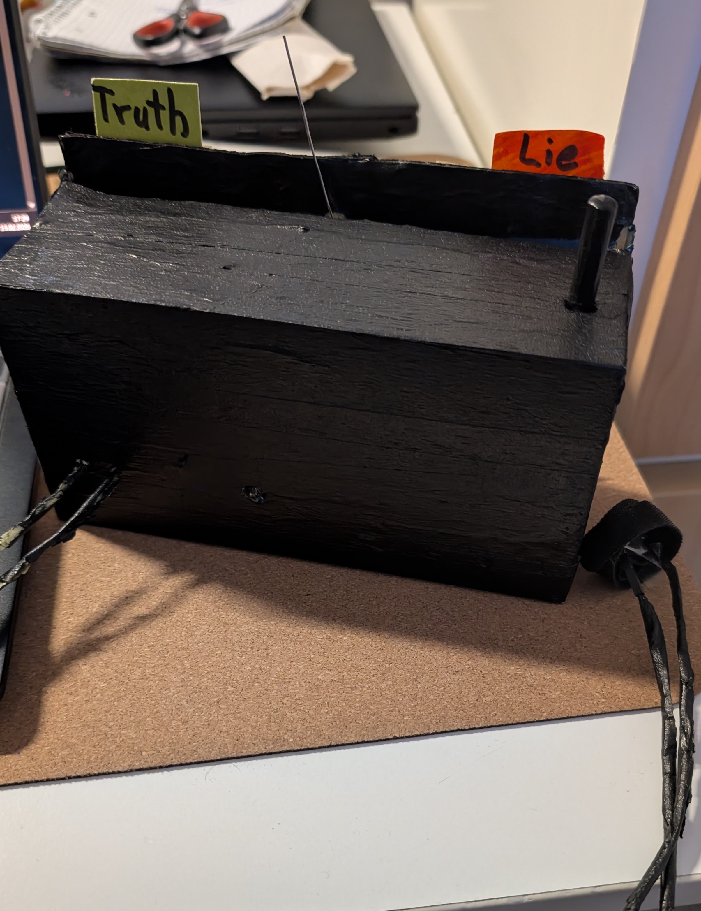
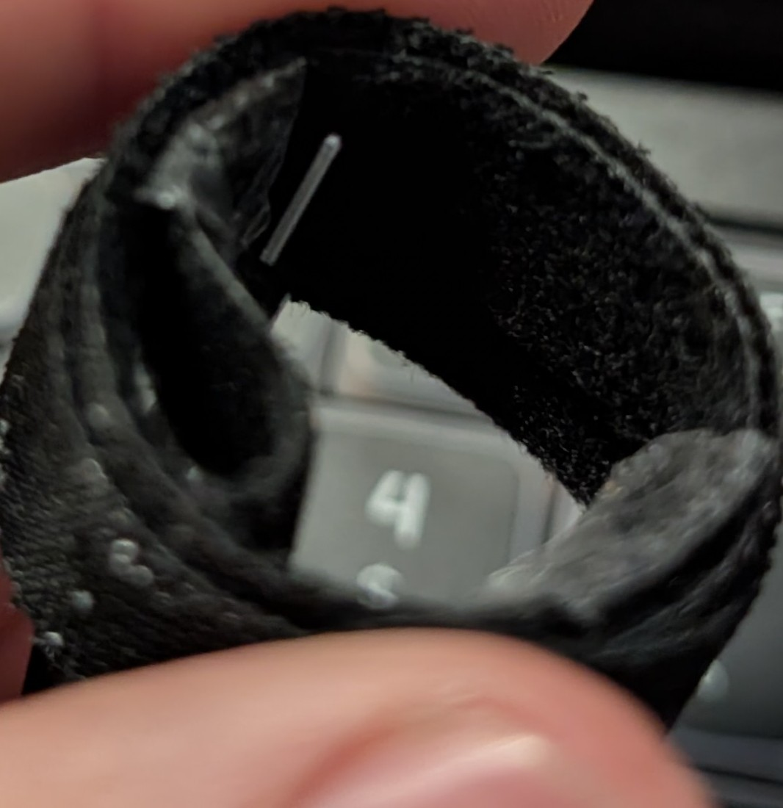
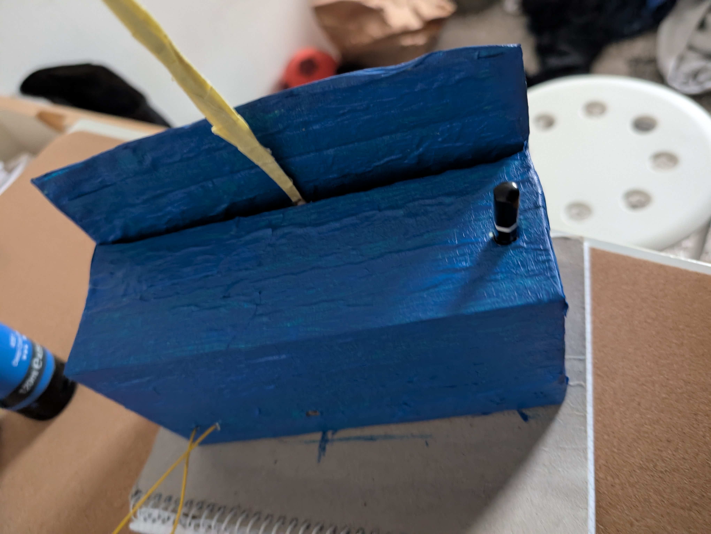
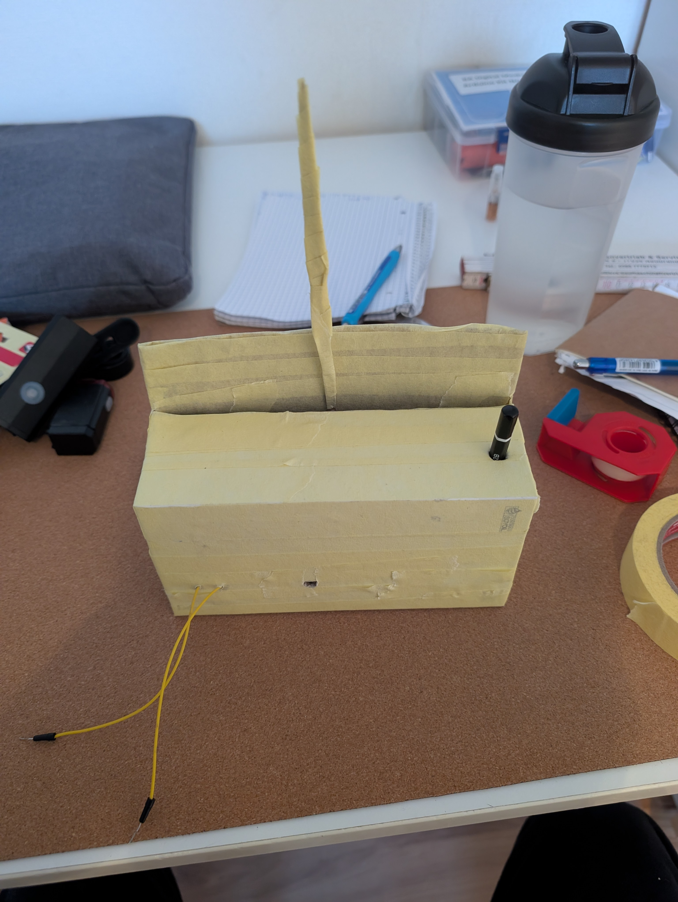
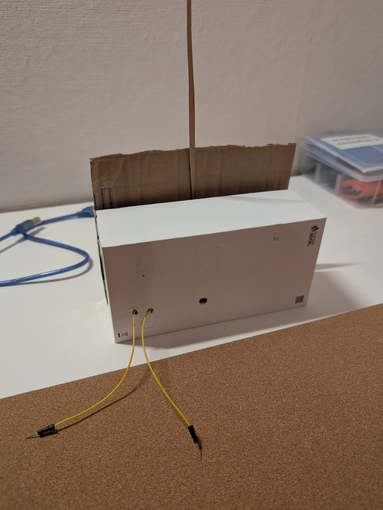
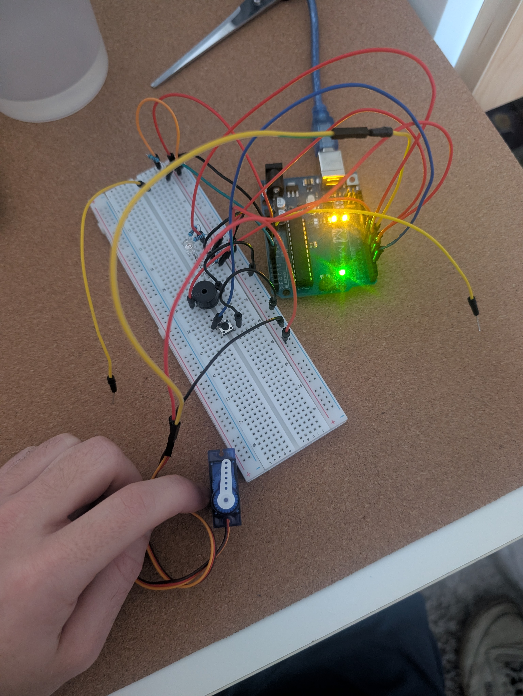
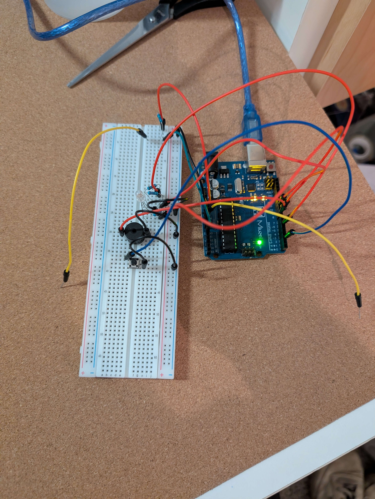
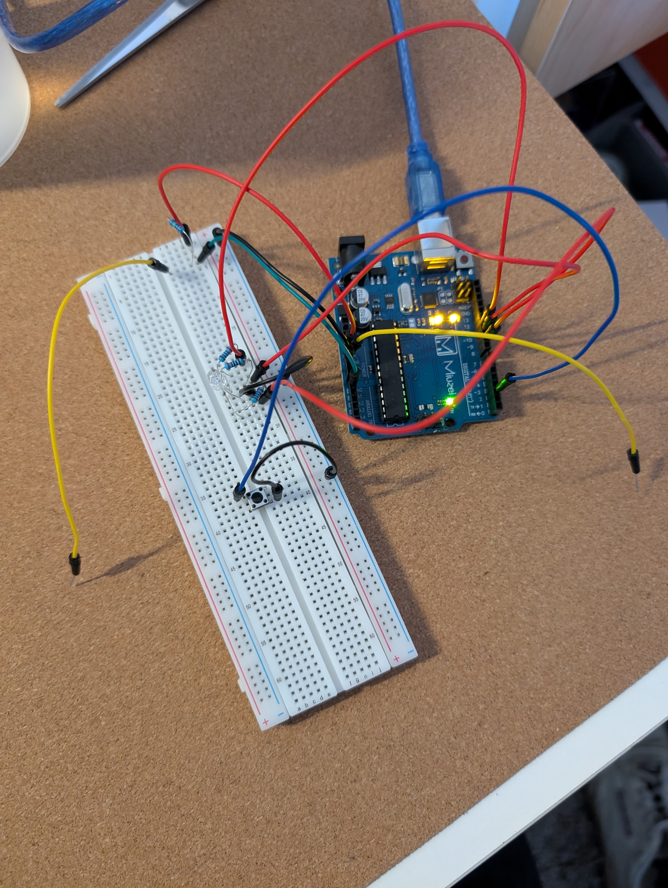
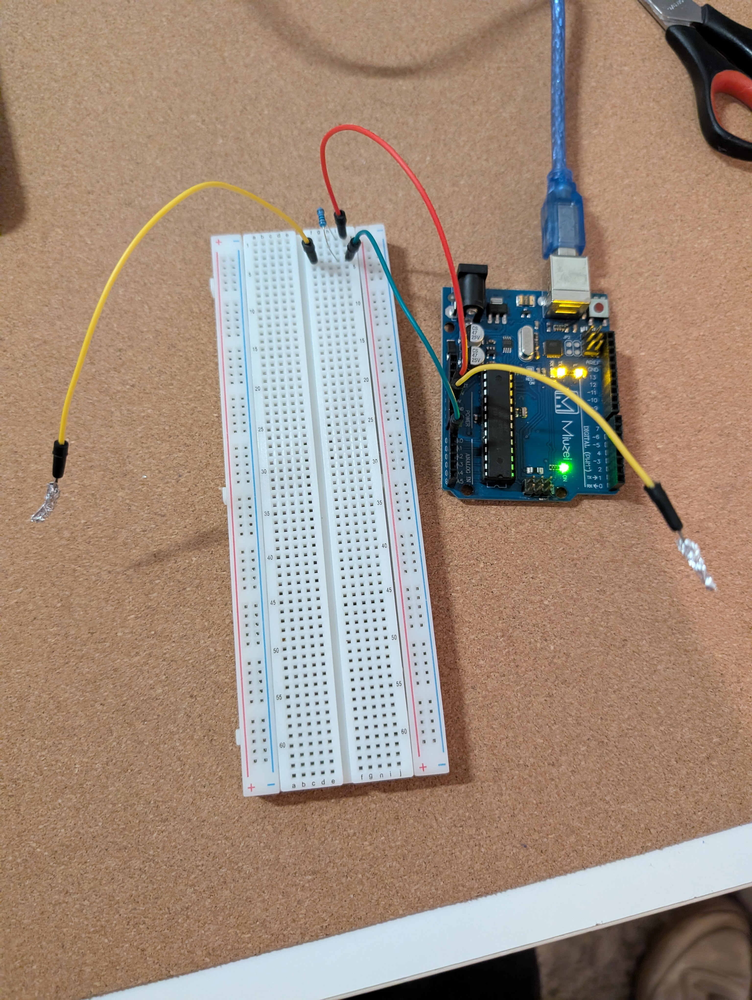

# Project: Lie Detector

## Change Log
Feb 15: taped cables and painted them and the case in all black design. Added Lie and Truth signs. Added a metal needle (unfolded paper clip).

Feb 15: Added a velcro to the ends of the cables, so the user doesn't have to hold the cables directly.

Jan 02: Painting the packaging in progress

Jan 02: Taped the packaging as base layer and to make it more stable.

Jan 02: Built the blank packaging

Dec 17: Corrected/Improved the GSR "LieDetection" Logic. Now it identifies all spikes or uncommon movements in resistance and counts them up all together. If certain threshold is crossed it is considered to be a LIE. Otherwise it is considered the TRUTH.

Dec 17: Updated the button and LED logic. If button is pressed there is 1s blue LED for calibration time. And purple LED if open circuit. Which means if the user doesn't hold the cables it doesn't start (Error).

Dec 17: Added Servo Motor on Pin 7 for a physical "Needle" output. Again I had to swap some pins from the RGB LED to resolve a hardware timer conflict between the servo library and the Tone library (took very long..)

Dec 16: Added passive buzzer for audio output(Ticking and Success/Fail sounds). Had to move Blue LED from Pin 11 to Pin 6 because somehow (after research and some bugs) the tone() function interferes with the PWM on Pin 11.

Dec 16: Added the RGB LED (Pins 9, 10, 11) and the Push Button (Pin 2). Now the device is standalone! First nothing happens, then the button is pressed, as the question is asked then the LED goes to Analyzing (Yellow) to Verdict (Red or Green).

I also tried adding clothes pins and alu foil for fixed contact to fingers, but it kinda hurts after a while... So currently the user just holds the ends of the wires lightly with the pointer finger and thumb on both hands.

Dec 15: Built the basic circuit with the DIY GSR sensor. And then swapped 10k resistor for 1M. Signal is stronger.

Dec 15: Tried to use platformIO to work in VS Code but I got very confused so I kept working in the Arduino IDE.